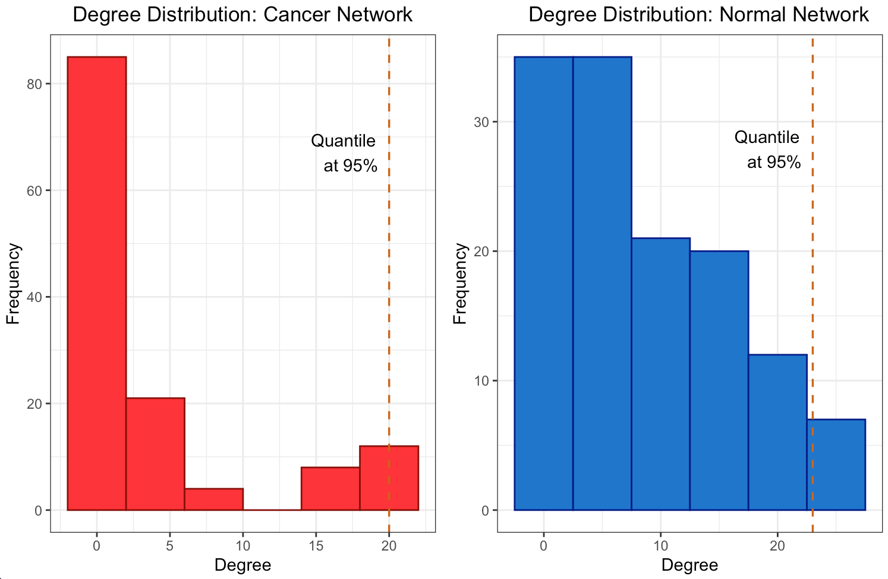

# Differential Analyses of Gene Expression in KIRP

## Abstract
This study analyzes gene expression in Kidney Renal Papillary Cell Carcinoma
(KIRP) using the TCGA-KIRP dataset, identifying differentially expressed genes
(DEGs) and constructing gene co-expression networks. It also develops a Patient
Similarity Network (PSN) to explore patient-specific disease traits, aiming to
enhance our knowledge of KIRP’s genetics for potential therapeutic advancements.

## Introduction
Kidney Renal Papillary Cell Carcinoma (KIRP) is a notable subtype of renal cell carcinoma, accounting for about 15% of kidney cancer cases. As detailed by [3], KIRP typically presents in two forms: the more prevalent and less aggressive Type 1, and the rapidly growing, more aggressive Type 2. Diagnosing KIRP often involves symptom evaluation, imaging techniques such as CT, MRI, and ultrasound, followed by biopsy confirmation and tailored patient treatments. Recent advancements in the understanding of KIRP’s molecular dynamics, as highlighted by [3][4],
are pivotal in refining therapeutic approaches. Our research contributes to this field by examining the
TCGA-KIRP dataset to identify differentially expressed genes (DEGs) in cancerous versus normal
tissue. We construct gene co-expression and differential co-expression networks, along with a Patient
Similarity Network (PSN), to deepen the genomic understanding of KIRP. This endeavor is intended
to inform future therapeutic innovations. Additionally, our study includes survival and enrichment
analyses to deep into the progression and impact of this disease.

## Materials and Methods

### Data
Gene expression data were sourced from the Genomic Data Commons (GDC) portal1. The analysis
focused on Transcriptome Profiling, specifically Gene Expression Quantification, processed using the
STAR - Counts workflow. The TCGA-KIRP project (Kidney Renal Papillary Cell Carcinoma) was
chosen for analysis, meanwhile patients were selected based on the availability of both cancer and
normal tissue files.
Gene expression data were downloaded using the GDCquery function, and subsequent preparation
was done with GDCprepare. Two sets of data were obtained: one for primary tumor samples and another for solid tissue normal samples and then combined and labeled appropriately using the
DESeq2 package in R. This approach included a critical filtering step to retain genes with significant
expression across most samples. Normalization was then conducted to mitigate technical variations.
The final step involved separating and refining the normalized data for clear differentiation between
cancerous and normal samples, ensuring robust and reliable inputs for the subsequent stages of our
analysis

### Differentially Expressed Genes (DEGs)
In our first analysis we applied specific thresholds to identify genes of interest with robust changes in
expression levels, so to visualize the differentially expressed genes. We established a fold change
threshold of $1.2$ on a $\log_2$ scale, which means that a gene’s expression must at least double or halve to
be considered significantly different in order to be significant. Moreover, we set an adjusted p-value
threshold of $0.05$ to control for false discovery rates in multiple testing.

### Co-expression Networks
In our co-expression network analysis we focused exclusively on differentially expressed genes (DEGs). We computed both Pearson and Spearman correlation coefficients for each gene pair among the 97 DEGs identified.

- Pearson $\rho = \frac{\sum (x_i - \bar{x})(y_i - \bar{y})}{\sqrt{\sum (x_i - \bar{x})^2}\sqrt{\sum (y_i - \bar{y})^2}}$

- Spearman $\rho = 1 - \frac{6 \sum d_i^2}{n(n^2 - 1)}$

The resulting correlation matrices were used to construct binary adjacency matrices, with a threshold of $\rho_{th} = 0.675$ for both Pearson and Spearman coefficients, determining edge connections. The degree of each gene within these networks was calculated as the sum of its connections to other genes.

### Differential Co-expressed Network
In this study, we employ the Fisher z-transformation to stabilize variances in correlation values between cancer and normal conditions of gene expression data, thresholding Z-scores calculated for gene pairs by comparing correlations in both conditions. 

$$ Z = \frac{z_1 - z_2}{\sqrt{\frac{1}{n_1 - 3}} + \frac{1}{n_2 - 3}} $$

Correlations with absolute z-scores under 3 are considered insignificant and set to 0; others are set to 1. A differential co-expressed network is constructed  and computing the top 5% nodes with the highest degrees identifies hubs across different networks and correlation methods. 

| Network Type | Correlation Method | Hub Genes                                      |
|--------------|--------------------|------------------------------------------------|
| Cancer       | Pearson            | ASPM [^1], ASF1B, KIF11 [^2], CEP55, CCNB2 [^2] |
| Normal       | Pearson            | PXDN, PLXNC1, FLT1, KDR, SLC16A9               |
| Cancer       | Spearman           | CCNB2, ASPM, BUB1B, KIF11 [^2], RRM2           |
| Normal       | Spearman           | SLC16A9, PTTG1, PLXNC1, KDR, FLT1              |
| Differential | Pearson            | AK4, LRRC20, FLT1, CCND2, RAPGEF4              |
| Differential | Spearman           | CCND2, RAPGEF4, FLT1, BUB1B, RRM2              |

[^1]: Deng et al., 2022
[^2]: Gao et al., 2019

| Metric      | Hub Genes                                      |
|-------------|------------------------------------------------|
| Degree      | ASPM [^1], ASF1B, KIF11 [^2], CEP55, CCNB2 [^2] |
| Closeness   | ITGA3, BRCA1, SNAI2, HGF, FAS                   |
| Betweenness | CHEK1, CTSZ, PLXNC1, KIF11 [^2], PTTG1 [^2]     |

[^1]: Deng et al., 2022
[^2]: Gao et al., 2019

Examining the hub genes (Table 1) we notice any overlap between cancer, normal and differential
network, indicating that most hubs are condition-specific, reflecting the distinct processes and
regulatory mechanisms that are active in cancerous versus normal states. On the other hand the hubs
are almost the same within the network type but different correlation method, it means certain genes
maintain central roles even changing correlations but not across conditions. Moreover, Table 2 shows
the importance of the metric chosen since with different ones we find different hubs.

### Patient Similarity Network (PSN)
We computed the Euclidean distance matrix for all significant genes in the cancer gene expression
profile then converted to a similarity matrix, where similarities were normalized and inversed and
diagonal elements set to zero to eliminate self-similarity. The PSN was constructed using it as
adjacency matrix representation, ensuring that edge weights were accounted for in the network
construction.
For community detection within the PSN, we first identified the largest component and then focused
on it for subsequent analysis applying the Louvain algorithm to detect communities. The PSN was
visualized with an emphasis on community structure employing a force-directed layout to ensure that
nodes belonging to the same community were positioned closer together

## Results and Discussion

### Volcano plot of DEGs
The volcano plot depicted in Figure 1 visualizes differentially expressed genes stratifying them by
potential biological significance from those with less important expression changes.

    

Down regulated: red points, before the first vertical line and above the horizontal line. Genes
with negative fold change (fc ≤ -fc.threshold) and a low adjusted p-value (pval.fc.fdr), they are
significantly reduced compared to the reference conditions.
Not expressed: between the two vertical lines or under the horizontal line. Genes not meet the fold
change and p-value criteria to be considered differentially expressed.
UP regulated: blue points to the right of the second vertical line and above the horizontal line.
Genes with positive fold change (fc ≥ fc.threshold) and a low adjusted p-value, they are significantly
increased compared to the reference conditions.

### Degree Distribution of the Networks
The degree distribution plots for the cancer and normal networks, depicted in Figures 2a and 2b, only
remotely resemble a power-law distribution, namely few genes have a high number of connections
while most of them have a relatively low number. However, the quantile line at 95% marks the threshold for the top 5% of hubs, a standard cut-off to define highly connected nodes suggesting
an unequal distribution of gene influence. In fact hubs may have a central role in orchestrating
the co-expression of many others. The scale-free structure suggests that our network is resilient to
random failures in such a way that remove less connected genes is likely to have a limited impact on
overall connectivity, unlike removing hubs.

    
    

### Subnetwork Plot of the Most Relevant Genes
The degree distribution plots (Figures 3a and 3b) reveal the frequency of connections per gene in the
differential co-expression network, calculated using Pearson and Spearman correlations, respectively.
The degree distributions suggest a quite random pattern, so they do not follow a power-law distribution
for sure, that could imply a lack of specific hub genes playing central roles in the differential co-
expression network. Despite this, Figures 4a and 4b visualize the subnetworks of the hubs, revealing
the most interconnected genes. This underlines the complexity of gene regulation in cancerous tissues
and the potential for these hubs to be key players in the disease’s molecular architecture

    
    

The differential co-expressed subnetworks, generated using Pearson and Spearman correlation
methods, demonstrate the interconnectivity between genes based on their co-expression patterns.
As it showed before in table 1 there are no differences in the hub genes sets formed from the two
correlation methods, Pearson and Spearman. In fact both subnetwork plots highlight same key hub
genes like AK4, LRRC20 and CCND2, indicating their significant role in the network connectivity
and to be critical in several aspects of gene regulation.

    
    

Comparing the degree distributions and the differential co-expression networks suggests distinct
patterns of gene interactions under cancer and normal conditions. The presence of specific hub genes
across different correlation methods underscores their potential role in disease progression as possible
targets for therapeutic intervention and potential biomarkers for disease.

### Network with Highlighted Community Structure
The use of PSN and community detection techniques provide insights into potential subgroups within
the network which could be crucial for understanding the heterogeneity of cancer at a genomic level
viewing the complex relationships between patients based on the similarity of gene expression profiles
in normal and cancerous tissues, respectively.

    
    

In the PSN (Figure 5) derived from normal tissue gene expression we observe two communities. Both
of them form a tight cluster indicates high degree of similarity among the gene expression profiles of
these patients. It suggests a subgroup with closely related physiological characteristics or a similar
response to environmental factors. Conversely, the PSN of cancerous tissue gene expression reveals
a structure with three communities. The orange one distinctly encircles a central core, potentially
representing a unique and aggressive cancer subtype with a specific gene expression signature and it
might correlate with a particular progression pattern or response to a treatment.
Comparing the two PSNs, it can be seen that the network complexity increases when analyzing
cancerous tissues because reflects the genetic variability introduced by the disease state.

### Gene Set Enrichment Analysis
This enrichment analysis results reveal key biological processes and pathways significantly associated
with the gene set providing a focused direction for subsequent experimental validation and research
into targeted treatments or diagnostics.

    
    

The Gene Ontology (GO) terms enrichment plot (Figure 6a) displays a spectrum of processes with
mitotic activities, such as ’Mitotic Sister Chromatid Segregation’ and ’Nucleosome Assembly’, being
highly represented. This suggests strong links between genes and cell division mechanisms based on
P-values: the darker they are the more statistically significant associations. On the other hand, the
KEGG pathway enrichment analysis (Figure 6b) highlights several critical cellular pathways as ’p53
signaling pathway’ and ’Cell cycle’ that may indicate their potential involvement in the disease’s
pathogenesis or progression. The ’Human T-cell leukemia virus 1 infection’ pathway’s presence is
particularly notable suggesting possible avenues for further investigation into viral interactions.

### Survival Analysis
The survival analysis provides a comparison of survival probabilities over time across different strata
within the studied population, suggesting age and sex do not have a statistically significant impact on
survival.

    
    

The first plot (Figure 7a) shows the survival probabilities of individuals under and over the age of 65,
resulting in overlapping curves with a p-value of 0.64 which indicates no significant difference in
survival between the two age groups. The second plot (Figure 7b) compares the survival probabilities
for females and males, suggesting a slight divergence in it because female’s curve shows a marginally
better survival trend. However, the difference is not statistically significant with a p-value of 0.13.
Finally, the shaded areas represent the 95% confidence intervals, a visual measure of the uncertainty
around the estimate. Moreover, the ’number at risk’ table below both survival curves takes into
account the number of individuals remaining in the study at various time points in order to reflects
the changing risk pool over the duration.
